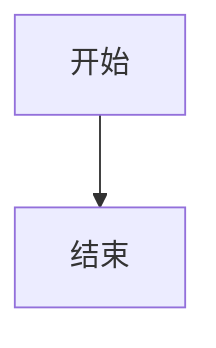

# Bookends

本地 Markdown 笔记站点生成器。将 `_posts/` 下的 Markdown 文件渲染为带目录导航、代码高亮和 Mermaid 图表的静态网站。

## 目录结构

```
_posts/           # 笔记源文件
  <分类>/         # 一级目录即分类（如 HTML、CSS、JavaScript）
    img/          # 分类级静态资源（cover.svg 放这里）
    cover.svg     # （已废弃，移到 img/ 下）
    *.md          # 笔记文件，按数字前缀排序
    <章节>/       # 可选：二级目录作为章节分组
      *.md
      img/        # 章节级静态资源
src/
  build.js        # 构建入口
  lib/
    parser.js     # Markdown → HTML 解析
    renderer.js   # HTML 页面渲染
  styles/
    main.css      # 主样式
    highlight.css # 代码高亮样式
  favicon.svg
config.json       # 站点配置（排序、标签名）
dist/             # 构建输出（Vite 开发服务器根目录）
```

## 使用

```bash
# 安装依赖
pnpm install

# 开发模式（热更新）
pnpm dev

# 构建
pnpm build
```

## 配置

编辑 `config.json`：

```json
{
  "order": ["HTML", "CSS", "JavaScript"],
  "labels": {
    "JavaScript": "JS"
  }
}
```

- `order` — 分类卡片排序，未列出的排在最后
- `labels` — 分类别名，用于覆盖目录名

## 功能

- **Markdown 渲染** — 基于 markdown-it，支持表格、代码块、内联 HTML
- **代码高亮** — highlight.js 自动着色
- **Mermaid 图表** — 按需加载，仅包含图表的页面才加载 mermaid.js
- **响应式布局** — 左侧文件树 + 中间正文 + 右侧大纲
- **封面图** — 每个分类在 `img/` 下放 `cover.svg` 或 `cover.png`

## 笔记格式

Markdown 文件以数字前缀命名，按数字排序：

```
_posts/CSS/
  img/cover.svg
  1.css是什么.md
  2.链接外部css.md
  ...
```

Mermaid 图表使用标准 fence 语法：

````markdown

````

封面图放 `_posts/<分类>/img/cover.svg`，构建后路径为 `dist/<分类>/img/cover.svg`。
